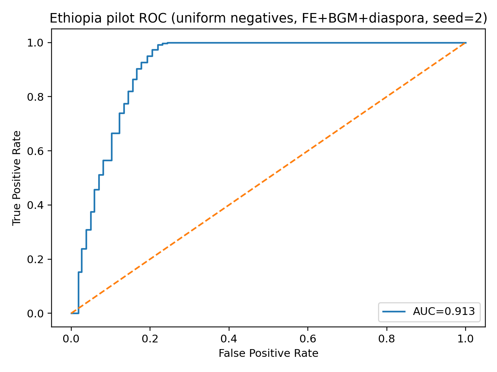

# Ethiopia forced-displacement pilot: destination choice modeling evidence pack (BGM)

**Author:** Arturo de Nieves (UNHCR Senior Operations Officer; IHEID Senior Fellow in Residence, incoming)  
**Contact:** denieves@unhcr.org  
**Purpose:** Provide credible evidence (performance, robustness, interpretability) for a gravity-style **destination choice** model for forced displacement, and propose integration into the team’s modeling stack.

---

## 1) Problem and ML framing
We model **household → camp destination** as a **dyadic choice** problem. For each refugee household *i*, the observed camp *d\** is treated as the positive choice (*y*=1) and we sample **kneg=10** alternative camps as negatives (*y*=0). We evaluate held-out performance using **GroupShuffleSplit by household id (hid)** to prevent within-household leakage. Primary metric: **AUC**.

**Dataset summary (pilot):** 3,627 refugee households; 5 origins; 19 camps; 39,897 dyads per run (3,627 positives + 36,270 negatives).

---

## 2) Model specification (no OD-pair memorization)
We explicitly exclude any origin×destination pair dummy (which can memorize OD propensity). The main specification is a gravity-style logistic model with **origin fixed effects** + **camp fixed effects** plus interpretable structural terms:

  

Where:  
- **α_o** are origin fixed effects  
- **γ_d** are camp fixed effects  
- **dE/dC/dS** are Mahalanobis distances in E/C/S blocks between origin and camp centroids  
- **diaspora_\*** are leave-one-out (LOO) network concentration features (to avoid trivial leakage)

**Terms (interpretation):**
- **α_o:** origin fixed effects (baseline origin pattern)
- **γ_d:** camp fixed effects (baseline camp pull/assignment propensity)
- **dE, dC, dS:** capital-space distances (compatibility/friction between origin and camp)
- **diaspora_\* (LOO):** network/path-dependence terms constructed with leave-one-out safeguards

---

## 3) Capital-space construction and distance
We construct household-level proxies for **Economic (E)**, **Cultural (C)**, and **Social (S)** “capitals” using interpretable survey-derived blocks:

- **Economic (E):** anchored in assets/food/nonfood proxies  
- **Cultural (C):** proxies from education/language/household composition fields available in roster/surveys  
- **Social (S):** proxies from household composition and network concentration (diaspora) features

We then define:
- **Origin centroid:** mean household vector by origin  
- **Camp centroid:** mean household vector by observed camp  

Distances are computed using **Mahalanobis** distance between origin and camp centroids within E/C/S blocks (blockwise covariance estimated from the corresponding centroid vectors).

---

## 4) Headline results (uniform negatives)
**Uniform negatives (kneg=10), mean±sd across 10 seeds:**
- **FE + BGM:** AUC **0.882 ± 0.004**
- **FE + BGM + diaspora(LOO):** AUC **0.906 ± 0.004**

---

## 5) Choice-set robustness (Table 1)
| Choice set regime | Specification | Mean AUC (sd) |
|---|---:|---:|
| Uniform negatives | FE + BGM | 0.882 (0.004) |
| Uniform negatives | FE + BGM + diaspora (LOO) | 0.906 (0.004) |
| Destination-neighbor hard negatives | FE + BGM + diaspora (LOO) | 0.872 (0.004) |
| Destination-neighbor hard negatives | + camp_pop | 0.872 (0.004) |
| Origin-diaspora hard negatives | FE only | 0.662 (0.010) |
| Origin-diaspora hard negatives | FE + diaspora (LOO) | 0.829 (0.005) |
| Origin-diaspora hard negatives | FE + BGM + diaspora (LOO) | 0.829 (0.005) |
| Origin-capital hard negatives | FE + BGM | 0.889 (0.002) |
| Origin-capital hard negatives | FE + BGM + diaspora (LOO) | 0.893 (0.004) |

**Mechanism takeaway:**
- If alternatives are built from **diaspora prominence**, diaspora saturates signal (expected).
- If alternatives are built from **capital proximity**, BGM dominates and diaspora adds incremental lift.

---

## 6) Interpretability: top coefficients (seed=2)
Uniform negatives (FE+BGM+diaspora):
- log_diaspora_share_lo: 2.728
- log_diaspora_od_lo: 0.439
- dC: -0.054
- dS: 0.032

Origin-capital hard negatives (FE+BGM+diaspora):
- log_diaspora_share_lo: 3.199
- log_diaspora_od_lo: 0.589
- dC: 0.561
- dS: 0.171

**Estimation note:** continuous terms are standardized within the training split; classifier is a regularized logistic regression.

---

## 7) One figure (ROC)

Notes: kneg=10; GroupShuffleSplit by hid; seed=2. ROC/AUC generated with a self-check against the reference implementation (AUC diff < 1e-3).

## 8) Governance and reproducibility stance
- This pack includes results and model specification.  
- **Raw microdata are not distributed.**  
- Full reproduction requires controlled access to microdata and the full pipeline.

**Code walkthrough + repo access available for collaborators (contact Arturo).**
